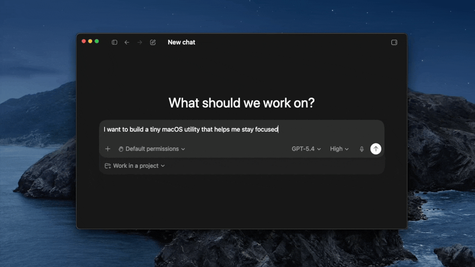
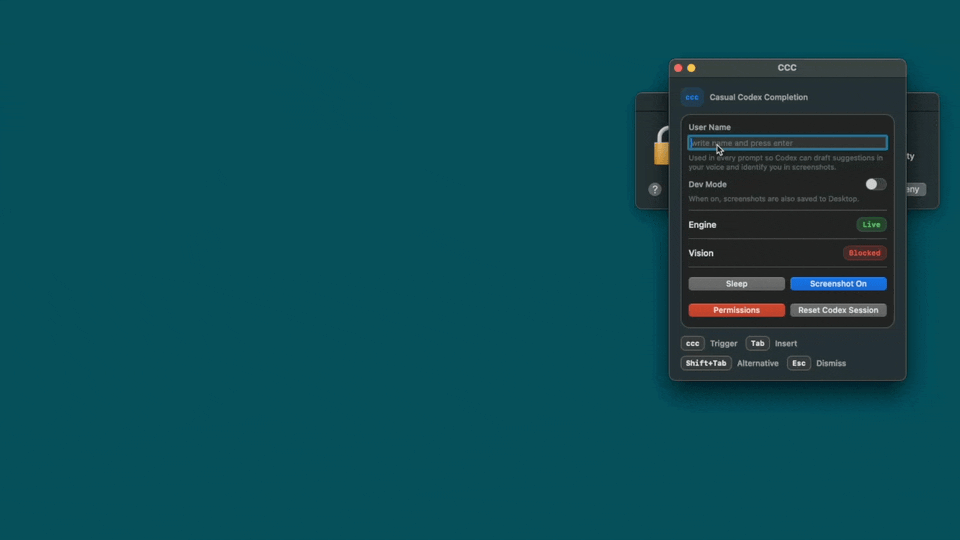

# CCC

CCC is for Casual Codex Completion ✨

Want CCC? Point Codex at this repo and tell it to follow [HOW_TO_INSTALL.md](HOW_TO_INSTALL.md), that's it.

CCC is a macOS app that lets you summon Codex into almost any textbox.

Smash the `c` key three times to summon CCC into your scope. CCC will call out to your local Codex CLI, pull back a completion, and offer it inline right where you are working. Notes, chats, docs, forms, prompts, random text fields: if you can type there, CCC aims to bring Codex there too.

The core idea is simple:

- summon Codex in any textbox
- stay inside the app you are already using
- get better as Codex gets better 🫡

## CCC In Action



CCC is built on top of Codex. CCC does not need to reinvent the brain. When Codex improves, CCC improves with it.

## Future

CCC might evolve from Casual-Codex-Completion to Casual-Codex-ComputerUse, going beyond text completion into broader on-screen assistance and action 🛸

Over time, CCC should get more personal. Through Codex Chronicle, it can build a better sense of how you write, what you care about, and how to help in a way that feels more like your own flow 🧠

Repo layout:

- app source in `Sources/CCCApp`
- prompt templates in `Resources/Prompts`
- build and packaging scripts in `scripts`
- release support files in `Support`
- install instructions in `HOW_TO_INSTALL.md`

## What the app does

- Runs as a lightweight macOS app with a small control window.
- Watches typing through a global event tap while the app is active.
- Requests a completion from the local Codex CLI when you hit `ccc`.
- Shows a floating suggestion.
- Accepts the suggestion into the active app through paste-based injection.

## Shortcuts

- `ccc`: summon a suggestion
- `Tab`: accept the visible suggestion
- `Shift+Tab`: retry and ask for another option
- `Escape`: dismiss the visible suggestion

## Requirements

- macOS 13+
- Codex desktop installed locally
- Swift 5.8+
- A usable Apple SDK

The supported build path is the repo scripts. `swift build` can work on machines with a full Xcode setup, but some Command Line Tools only installs fail to resolve the required macOS platform path.

All supported scripts share the same explicit minimum deployment target: macOS `13.0`.

## Permissions In Action



## Local Development

Run the app locally:

```bash
scripts/run-local.sh
```

On first run the script creates `.local/config.toml` from `Support/config.example.toml`. That file is ignored by git and is the right place for local changes.

The script also keeps local runtime state under `.local/state/`, so session ids and dev-only config do not leak into the repo.

## Build And Package

Build a distributable `.app` bundle:

```bash
scripts/build-app.sh
```

Create a zip you can attach to a GitHub release:

```bash
scripts/package-release.sh
```

Install the built app into `~/Applications`:

```bash
scripts/install-app.sh
```

Remove the installed app and its user data:

```bash
scripts/uninstall-app.sh
```

## Runtime Config

CCC looks for config in this order:

1. `CCC_CONFIG_FILE`
2. `~/Library/Application Support/CCC/config.toml`

For local repo development, `scripts/run-local.sh` sets `CCC_CONFIG_FILE` to `.local/config.toml`.

Supported keys:

```toml
codex_cli_path = "/Applications/Codex.app/Contents/Resources/codex"
model = "gpt-5.5"
dev_mode = false
```

Optional overrides:

```toml
# reasoning_effort = "medium"
# user_name = "Your Name"
# prompt_prefix_char_limit = 4096
```

Defaults:

- `codex_cli_path` defaults to the standard Codex desktop bundle path when present
- `model` defaults to `gpt-5.5`
- `reasoning_effort` defaults to `medium`
- `prompt_prefix_char_limit` defaults to `4096`
- `dev_mode` defaults to `false`

## Permissions

On first run, macOS may ask for:

- Accessibility
- Input Monitoring
- Screen Recording when screenshot context is enabled

Why they matter:

- Accessibility: required for text context probing and general cross-app integration.
- Input Monitoring: required to watch global key events so `ccc`, `Tab`, `Shift+Tab`, and `Escape` work across apps.
- Screen Recording: only needed when screenshot context is enabled, so Codex can use the current window as extra context.

Without these permissions, completion capture and screenshot-assisted context will degrade or fail.

## Logs

Logs are written to:

```bash
~/Library/Logs/CCC/ccc.log
```

## Install Notes

Installation and release instructions live in [HOW_TO_INSTALL.md](HOW_TO_INSTALL.md).

That keeps the install story explicit without shipping a Codex-only wrapper that would remain installed after the app itself is set up.

## Contributing

Collaborators are welcome. The ground rules are simple:

- keep the repo clean
- do not commit `.local`, `.build`, `dist`, screenshots, or session files
- prefer focused changes over broad refactors

See [CONTRIBUTING.md](CONTRIBUTING.md) for the short contributor workflow.

## Current Limitations

- This is not a true IME.
- Existing editor context is limited unless Accessibility can read it.
- Paste-based insertion is less native than editor-specific integrations.
- Secure text fields are out of scope.
